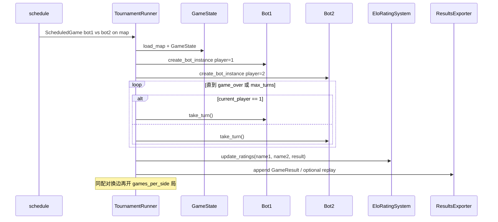

> 返回：[源码总览](overview.md) · [算法总览](../algorithms/overview.md) · [索引](../AGENTS.md)

# 锦标赛系统：调度、对局、ELO 与导出

本文覆盖 `reinforcetactics/tournament/` 包与 CLI 包装 `scripts/tournament.py`：如何组织循环赛、实例化 Bot、更新评分并落盘结果。

---

## 位置

| 路径 | 角色 |
|------|------|
| `reinforcetactics/tournament/runner.py` | `TournamentRunner` 执行引擎 |
| `reinforcetactics/tournament/bots.py` | `BotType`、`BotDescriptor`、发现与工厂 |
| `reinforcetactics/tournament/schedule.py` | 循环赛赛程、`MapConfig`、`ScheduledGame` |
| `reinforcetactics/tournament/results.py` | `GameResult`、`TournamentResults`、导出 |
| `reinforcetactics/tournament/config.py` | `TournamentConfig` |
| `reinforcetactics/tournament/elo.py` | `EloRatingSystem` |
| `scripts/tournament.py` | 命令行入口（薄封装） |
| `docker/tournament/` | 容器化锦标赛（可选） |

---

## 文件清单

| 符号 | 说明 |
|------|------|
| `TournamentRunner` | 调度 → 并发/顺序执行 → 汇总 → 回放/导出 |
| `BotDescriptor` | 参赛者描述（规则 / LLM / 模型） |
| `BotType` | `SIMPLE` / `MEDIUM` / `ADVANCED` / `MASTER` / `LLM` / `MODEL` |
| `create_bot_instance` / `discover_all_bots` | 实例化与自动发现 |
| `generate_round_robin_schedule` | 全配对 + 换边场次 |
| `EloRatingSystem` | 标准 Elo：期望分、K 因子更新 |
| `ResultsExporter` | CSV / JSON / 站榜 |
| `TournamentConfig` | 地图池、每边局数、并发、输出目录等 |

---

## 职责

1. **赛程**：所有 Bot 两两对阵；每对在多地图、`games_per_side` 下双方先后手互换。
2. **对局**：用 `GameState` + Bot `take_turn()` 跑完整游戏（非 RL env 步循环）。
3. **评分**：每局后更新 Elo。
4. **产物**：战绩矩阵、站榜、可选回放与 LLM 对话日志。
5. **可恢复**：`set_completed_matches` 跳过已完成对局。

---

## 数据结构

### `TournamentConfig`（概念字段）

| 字段 | 含义 |
|------|------|
| `maps` / 地图池模式 | 单图、列表或目录；`cycle` / `random` / `all` |
| `games_per_side` | 每方先手局数（默认 2 → 每配对至少 4 局） |
| `max_turns` | 单局上限 |
| `output_dir` | 结果根目录 |
| `save_replays` / `replay_dir` | 回放 |
| `concurrent` | 并发对局数 |
| `log_conversations` | LLM 日志 |

### `ScheduledGame`

`game_id`, `bot1`, `bot2`, 地图 `MapConfig`（`path`, `max_turns`）, 座位（谁是 player 1）等。

### `BotDescriptor`

轻量配置，延迟创建真实 Bot：

- 规则：`BotDescriptor.simple_bot("SimpleBot")` 等。
- LLM：`model`, `provider`, `temperature`, `api_key`…
- 模型：`model_path` → 加载 PPO/Feudal/等为 `ModelBot`。

### `GameResult` / 站榜

单局胜负、时长、双方名、地图；聚合为胜场、Elo 序列。

### Elo

\[
E = \frac{1}{1 + 10^{(R_{\text{opp}}-R)/400}},\quad
R' = R + K\,(S - E)
\]

默认 `starting_elo=1500`，`k_factor=32`。

---

## 核心逻辑

### 一轮配对（matchup round）



并发：`ThreadPoolExecutor`（`concurrent > 1`），结果写入用锁保护。

### CLI（`scripts/tournament.py`）

典型参数：

```text
python scripts/tournament.py
  --maps ... | --map-dir maps/1v1/ --map-pool-mode all
  --models-dir models
  --output-dir tournament_results
  --games-per-side 2 --max-turns 500
  --concurrent 1
  --no-llm / --no-models
  --log-conversations
```

流程：解析参数 → `discover_all_bots` → `TournamentConfig` → `TournamentRunner.run(bots)`。

### 发现参赛者

| 来源 | 开关 |
|------|------|
| 内置 Simple/Medium/Advanced/… | 默认 |
| `models/` 下检查点 | `--no-models` 关闭 |
| 已配置 API 的 LLM | `--no-llm` 关闭 |

---

## 与需求关系

| 需求 | 落点 |
|------|------|
| 客观比较 Bot / 模型 | 循环赛 + 换边消先手优势 |
| 排行榜 | Elo + standings CSV |
| 回归 / 发版验收 | 固定地图池 + 可复现配置 |
| 调试 LLM | conversation logs |
| 与训练解耦 | 直接 `GameState` + Bot，不经 `StrategyGameEnv` |

---

## 相关算法

| 文档 | 关系 |
|------|------|
| [evaluation-and-elo.md](../algorithms/evaluation-and-elo.md) | Elo 与评估协议 |
| [game-bots.md](game-bots.md) | 规则 Bot 强度层级 |

模型 Bot 加载细节见源码 `game/model_bot.py`（源码分文档 `game-llm-and-model-bots.md` 若已写）。

---

## 延伸阅读

- 包入口：`reinforcetactics/tournament/__init__.py`
- 测试：`tests/test_tournament.py`、`test_tournament_config.py`、`test_tournament_library.py`
- 历史结果样例：`tournament_results/`
- Docker：`docker/tournament/README.md`
- 站点文档：`docs-site/docs/tournament-system.md`
