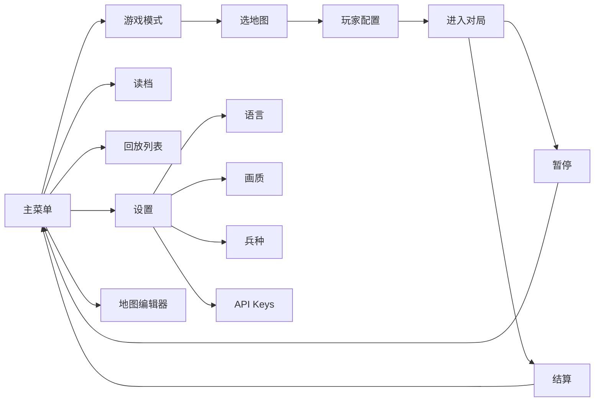

> 返回：[源码总览](overview.md) · [算法总览](../algorithms/overview.md) · [索引](../AGENTS.md)

# UI 与菜单总览（高层）

本文只描述 **表现层菜单结构与导航**，不深入战斗渲染每一像素。对局循环见 `app-runtime`（若已写）；基础设施（字体、语言、设置）见 [utils-infra.md](utils-infra.md)。

---

## 位置

| 路径 | 角色 |
|------|------|
| `reinforcetactics/ui/menus/` | 全部菜单屏 |
| `reinforcetactics/ui/renderer.py` | 棋盘 / 单位 / HUD 绘制 |
| `reinforcetactics/ui/widgets/` | 按钮、对话框、文本输入 |
| `reinforcetactics/ui/theme.py` | 颜色与间距 |
| `reinforcetactics/ui/icons.py` | 导航/控件图标 |
| `reinforcetactics/ui/sprite_animator.py` | 精灵动画 |
| `reinforcetactics/ui/components/` | 可复用 UI 组件 |

---

## 文件清单（菜单树）

```text
ui/menus/
  base.py                 # BaseMenu、事件排空、Back 多语言识别
  main_menu.py            # 主菜单
  credits_menu.py
  game_setup/
    game_mode_menu.py     # 1v1 / 1v1v1 / 2v2 等
    map_selection_menu.py
    player_config_menu.py # 人类 / 电脑 / 难度 / LLM / 模型
  in_game/
    pause_menu.py
    game_over_menu.py
    unit_action_menu.py   # 移动/攻击/占领…
    unit_purchase_menu.py
    confirmation_dialog.py
    quit_confirm_dialog.py
  settings/
    settings_menu.py
    language_menu.py
    graphics_menu.py
    units_menu.py         # 启用兵种
    api_keys_menu.py      # LLM 密钥
  map_editor/
    map_editor_menu.py
    map_editor.py / editor_canvas.py / tile_palette.py / new_map_dialog.py
  save_load/
    load_game_menu.py
    save_game_menu.py
    replay_selection_menu.py
    utils.py
```

**Widgets**：`button.py`、`dialog.py`、`text.py`、`text_input.py`。

**Renderer**：`Renderer` 读 `GameState` + `Settings` 精灵路径，绘制地形、单位、可见性（雾战）、选中高亮、血条等。

---

## 职责

| 区域 | 职责 |
|------|------|
| **主菜单** | 新游戏、读档、回放、设置、制作人员、退出 |
| **开局配置** | 模式 → 地图 → 玩家类型与对手 |
| **局内** | 暂停、单位动作/购买、结束确认、胜负屏 |
| **设置** | 语言、画质/精灵、兵种开关、API Key |
| **地图编辑器** | 画瓦片、存 CSV 到 `maps/` |
| **存读档/回放** | `saves/`、`replays/` 列表与加载 |
| **Renderer** | 纯展示，不改规则逻辑 |

菜单自管理 pygame 事件循环，子菜单返回后 `drain_events()` 防点击穿透。

---

## 数据结构

- 菜单选项多为「文案键 + 回调 / 返回值」；文案经 `language.TRANSLATIONS` + `get_language()`。
- 开局结果通常是：地图路径、`player_types`、启用单位、雾战等，交给 `app/game_loop` 建 `GameState`。
- `Settings` 单例（`utils/settings.py`）持久化到 `settings.json`。

---

## 核心逻辑

### 菜单导航（简化）



- 键盘：方向键移动、Enter 确认、Esc 返回/退出（`base` 与各菜单 hint）。
- 紧凑布局：窗口高度 < `COMPACT_LAYOUT_MIN_HEIGHT`（480）时收紧页脚与箭头。
- 中文/韩文：`get_font` / `get_display_font` 切 CJK 系统字体（见 [utils-infra.md](utils-infra.md)）。

### Renderer 与菜单关系

- 菜单屏：多数全屏 UI，不依赖棋盘。
- 对局中：`GameSession` 每帧调 `Renderer`，叠加 `in_game` 弹出菜单。
- 回放：`ReplayPlayer` 自绘控件 + 同一渲染风格。

---

## 与需求关系

| 需求 | 落点 |
|------|------|
| 本地人机 / 人人对战 | game_setup → app 循环 |
| 切语言不乱码 | language 菜单 + fonts CJK 路径 |
| 配 LLM 密钥 | `settings/api_keys_menu` → `settings.json` |
| 自制地图 | map_editor → CSV |
| 观战录像 | replay_selection + ReplayPlayer |
| 关闭某兵种做消融 | units_menu → `game.enabled_units` |

---

## 相关算法

UI 不实现 RL 算法。对战 Bot 选择影响的是决策层，见 [game-bots.md](game-bots.md) 与源码 Bot 工厂。

---

## 延伸阅读

- 基建与 i18n：[utils-infra.md](utils-infra.md)
- 中文覆盖：[`usage/chinese-i18n-coverage.md`](../usage/chinese-i18n-coverage.md)
- 中文方框排查：[`troubleshooting/chinese-font-display.md`](../troubleshooting/chinese-font-display.md)
- 本地运行：[`usage/local-run-guide.md`](../usage/local-run-guide.md)
- 地图编辑器用户文档：`docs/MAP_EDITOR.md`
- 测试：`tests/test_menus.py`、`test_menu_layout.py`、`test_language_menu.py`、`test_map_editor.py`
